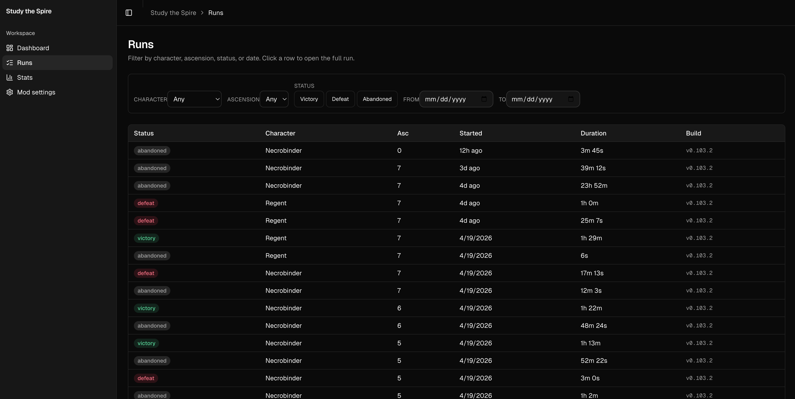
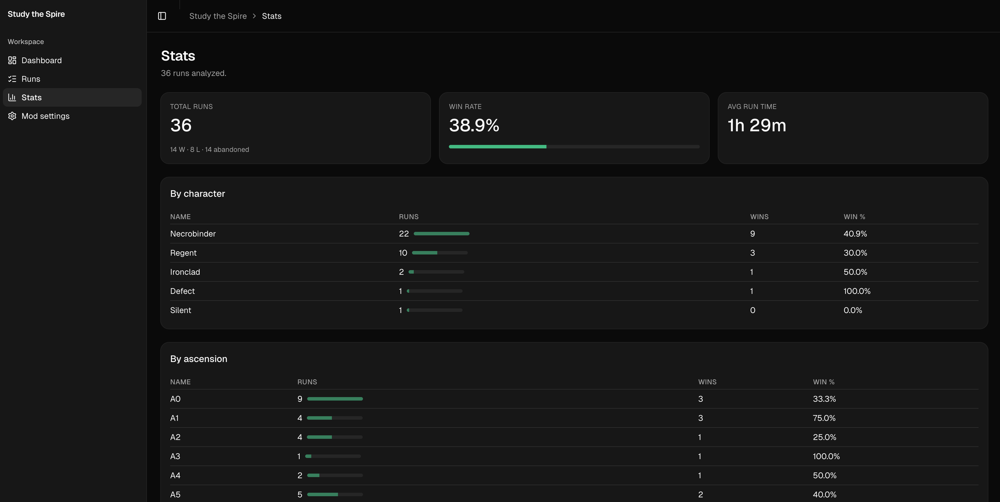

# Study the Spire

**Turn every run into a lesson.**

A public **Slay the Spire 2** run tracker and analyzer. Live at **[studythespire.com](https://studythespire.com)**.

A thin **C# mod** watches your save folder and uploads finished run files. A
**Kotlin (Kairo) API** on Cloud Run normalizes them into Cloud SQL Postgres. A
**Next.js** dashboard on Vercel (with Clerk auth) lets you filter, browse, and
study your runs.

## How it works

1. Sign in at [studythespire.com](https://studythespire.com).
2. Generate an upload token in **Mod settings**.
3. Drop the token into the mod's `config.ini`. Launch StS2.
4. Every finished run in `saves/history/` is hashed, validated, and uploaded
   exactly once. Re-launches re-sweep the directory; offline games retry on
   next launch.
5. The dashboard shows them, filtered, with aggregate stats.

## Repository layout

| Path | Role |
|------|------|
| `mod/` | C# game mod / exporter (Godot.NET SDK, .NET 9) |
| `backend/` | Kotlin + Kairo API (Cloud Run + Cloud SQL Postgres) |
| `web/` | Next.js dashboard (Vercel + Clerk) |
| `contracts/` | OpenAPI, event and run-file JSON Schemas, examples |
| `infra/` | Cloud Run deploy script, local Docker setup |
| `docs/` | Architecture, API, mod setup, deploy notes |
| `tools/` | Mock backend, contracts validator |

## Status

WORK IN PROGRESS.

Built up over milestones (see `references/study-the-spire-build-plan.md` if you
want the full play-by-play). Currently:

- ✅ Auth end-to-end (Clerk → Kairo JWT verifier).
- ✅ Per-user upload tokens (`stsa_live_…`), rotatable from the dashboard.
- ✅ Run-file capture: mod watcher, schema-aware uploader, idempotent backend
  imports with normalized columns.
- ✅ Filterable, paginated run list and aggregate stats summary.
- 🚧 Card / relic level analysis, AI coach chat, live in-run events.

## Docs

- [Architecture](docs/architecture.md)
- [API](docs/api.md) and [contracts/](contracts/)
- [Mod setup](docs/mod-setup.md)
- [Web deploy](docs/web-deploy.md)
- [Dev setup](docs/dev-setup.md)
- [Release process](docs/release-process.md)

Agent-oriented notes: [`AGENTS.md`](AGENTS.md).
